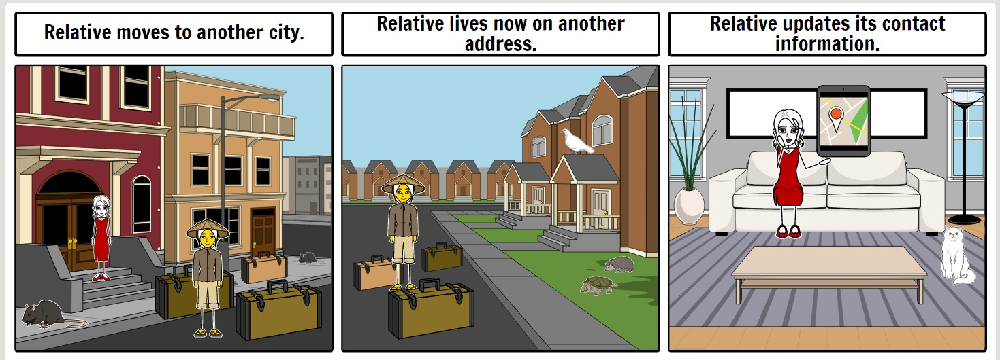
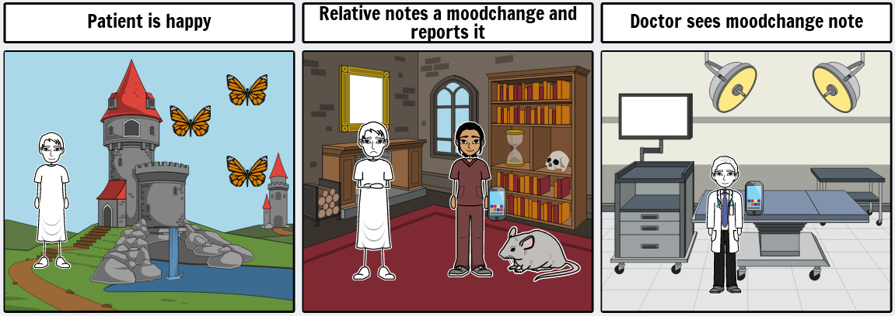
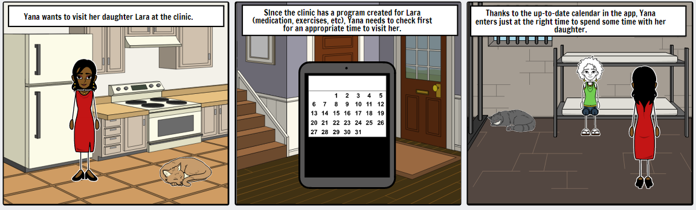
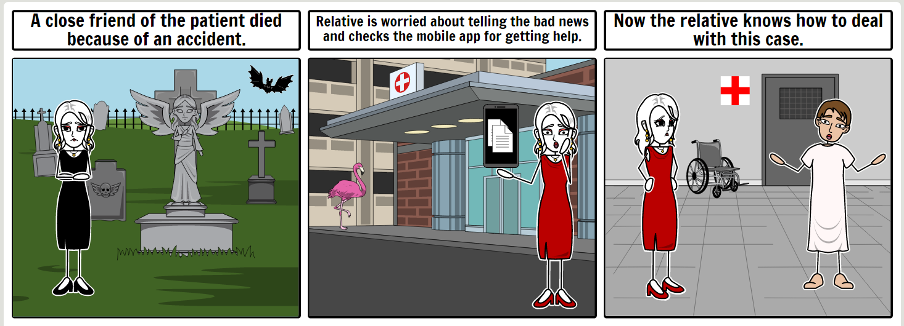
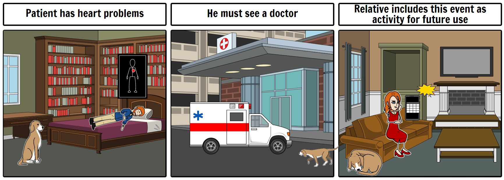
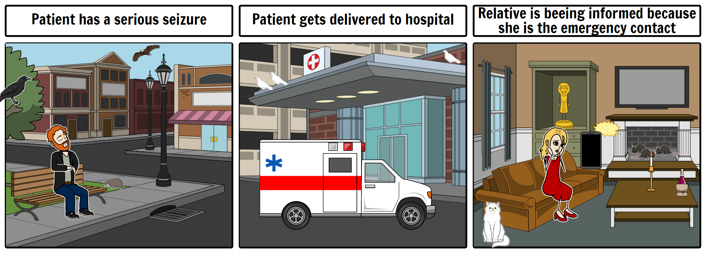

# Story boards

## Story 1: Runaway

## Story 2: Moving house

## Story 3: Medication

## Story 4: Mood change

## Story 5: New insurance

## Story 6: Tracking location

## Story 7: Visiting time

## Story 8: Getting help

## Story 9: Record activities

## Story 10: Emergency contact

