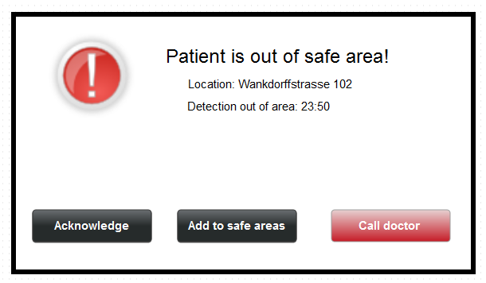
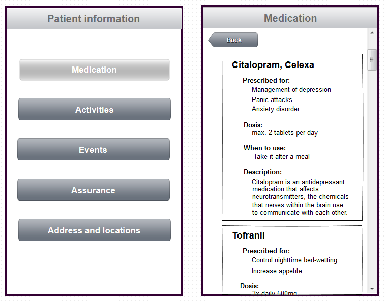
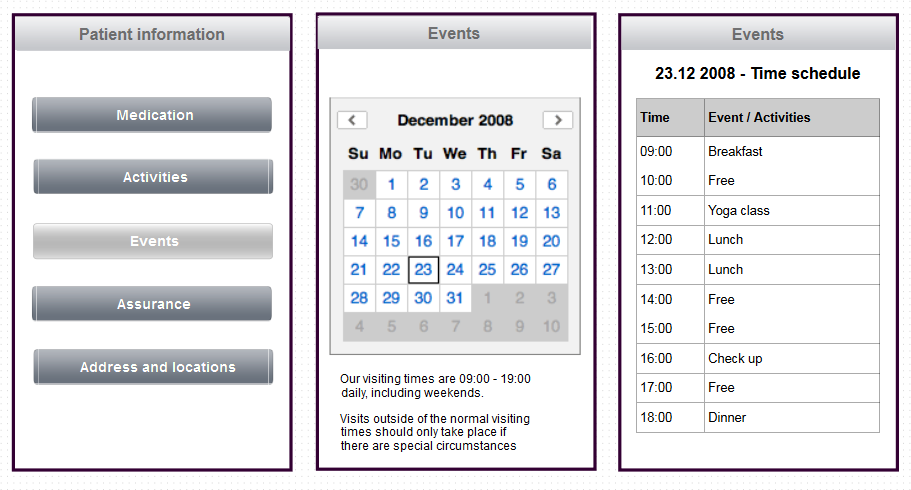

# Prototypes

These are the prototypes for our three most promising stories.

Stories can be found here: [Stories](04_StoryBoards.md)

## Prototype for Story 1: Run away

## Prototype for Story 3: Medication

## Prototype for Story 7: Visiting times

## Mögliche Struktur

### Stammdaten (alles formale
- Name, Vorname, Adresse, Tel, Mail von allen relatives
- Krankenkasse
- andere Ärzte (Frauenarzt, Zahnarzt, Hausarzt)

### Info über Patient
- aktuelle Medikation
- aktuelle Ziele (z.B. Berufsfindung)
- Wochenendinfo (was soll gemieden werden, worauf Acht geben)
- Jahresplanung (Projektwochen, Ausflüge, Skilager)
- Ein-/Austritte (am Wochenende, fixer Eintrag)

### Pinnwand
- aktuelle Ereignisse/Vorfälle
-- z.B Grippe/Arztbesuch/Tot Grossmutter
-- keine Bewertung des Psychostatus
- kein Ersatz des mündlichen Austausches

### Kalender/Agenda
- Tagesablauf/Therapie, Termine (auch privat)
- Terminerfassung möglich (für ein Besuch oder Familientherapie)

### Notifikation
- Standortübermittlung (nur wenn von Patient ausgelöst)
- Medikation
