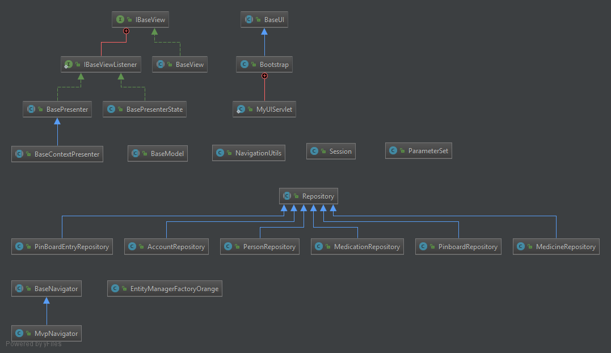

# Final Presentation

MHC-PMS - Relatives

## Implementation Highlights

### Navigation mit Vaadin

+ Navigator Klasse
+ Parameterübergabe zwischen Views

```java
public class MvpNavigator extends BaseNavigator {
    /**
     * Adds the view to the navigator and optionally also to the menu of the Bootstrapper.
     * @param presenter: Presenter (represents an MVP set) to be observed by the navigator.
     * @param addToMenu: Switch, if the View should be available through the menu.
     */
    public void addView(BasePresenter presenter, VaadinIcons icon, boolean addToMenu) {
        addView(presenter.getView().getViewName(), presenter.getView());
        views.add(presenter.getView());

        if (addToMenu)
        {
            MenuBar.MenuItem firstMenuItem = navigationBar.getItems().get(0);
            navigationBar.addItemBefore(presenter.getView().getCaption(), icon, menuItem -> navigateTo(presenter.getView().getClass()), firstMenuItem);
        }
    }
    
    /**
         * Navigates to the specified View
         * @param destinationView: View to be navigated to
         * @param parameterSet: Parameters to be passed to the view
         * @param <T>: Class extending BaseView
         */
        public <T extends BaseView> void navigateTo(Class<T> destinationView, ParameterSet parameterSet)
        {
            // Navigation to logon view is always possible
            if (getUI().sessionActive() || destinationView.equals(LogonView.class)){
                viewHistory.add(destinationView);
                views.stream()
                        .filter(components -> components.getClass().equals(destinationView))
                        .findFirst()
                        .ifPresent(components -> navigateTo(NavigationUtils.combineNameAndParams(components.getViewName(), parameterSet)));
            } else { // Navigation to other view than logon despite no valid session
                ParameterSet parameter = new ParameterSet();
                parameter.addParameter("timeout", "true");
                viewHistory.add(LogonView.class);
                views.stream()
                        .filter(components -> components.getClass().equals(LogonView.class))
                        .findFirst()
                        .ifPresent(components -> navigateTo(NavigationUtils.combineNameAndParams(components.getViewName(), parameter)));
            }
        }
    
        /**
         * Navigates one step back
         */
        public void navigateBack()
        {
            if (viewHistory.size() > 2){
                // Navigate to last view. Current view is size -1, last view is size -2
                navigateTo(viewHistory.get(viewHistory.size() - 2));
            }
        }
    
        /**
         * Resets Navigation history
         */
        public void resetViewHistory(){
            viewHistory.clear();
        }
    
}
```

### Vaadin Data Binder

+ Databinding mit vaadin Data Binder (package com.vaadin.data;)
+ Databinding mittels Predicated

```java
public abstract class PersonGrid<P extends Person> extends VerticalLayout {
    private Binder<P> binder;
    private P person;
    private TextField firstName = new TextField("Vorname", "");
    
    public PersonGrid(P person) {
        binder = new Binder<>();
        binder.forField(firstName)
        .asRequired("Darf nicht leer sein")
        .bind(Person::getFirstName, Person::setFirstName);
        binder.readBean(patient);
    }    
    
     @Override
     public void onSave(PersonGrid personGrid) {
         //...
         personGrid.getBinder().writeBeanIfValid(personGrid.getPerson());
         //...
     }
}
```

### Generisches Repository

+ Ein generisches Repository dient als Basisklasse für alle spezifischen Repositories

```java

/**
 * @author yvesbeutler
 * Abstract class for the generic repository which provides CRUD functionality.
 */
public abstract class Repository<T extends Identity> {
           public T persist(T obj) {
               em.getTransaction().begin();
       
               if (obj.getId() > 0 ) {
                   em.merge(obj);
               }
               else {
                   em.persist(obj);
               }
       
               em.getTransaction().commit();
               return obj;
           }
           
           /**
            * Removes a given object from the database.
            * @param obj Subtype of Identity
            * @return true if successfully removed
            */
           public boolean remove(T obj){
               em.getTransaction().begin();
       
               if (em.contains(obj)){
                   em.remove(obj);
                   em.getTransaction().commit();
                   return true;
               }
       
               return false;
           }
           
           /**
            * Finds an object by its ID in the database.
            * @param id the ID used by the database
            * @return Optional to prevent {@link NullPointerException}
            */
           public Optional<T> find(long id){
               T obj = em.find(entityClass, id);
               return Optional.ofNullable(obj);
           }
}

public class PinboardRepository extends Repository<PinBoard> {
    //...
}

```

## Entwicklungsprozess

Während der Entwicklung haben wir Features in entsprechenden Feature branches entwickelt. Diese haben wir gereviewed und via pull request gemerged.
 
Dadurch konnten einzelne Entwickler ungestört und parallel an ihren Features arbeiten und diese dann, wenn diese fertig sind, in den Develop Branch mergen.

Zusätzlich wurde der Master Branch gesperrt, so dass man nur via Pull Requests einchecken kann. Dies garantiert, dass die Mindestanzahl der Reviews (kann definiert werden) eingehalten wird.


Das Resultat im Master Branch sieht folgendermassen aus:


## Architektur

Wir haben Basisklassen für die MVP Struktur, die Bedienung mit Vaadin und für die Repositories erstellt. Basisklassen überschreiben bzw. erweitern Grundfunktionalität zur Navigation und Zugriff auf Vaadin-Resourcen bzw. Runtime-Informationen.

Der MVPNavigator nimmt ein MVP Packet an und sorgt dafür, dass diese in die Navigation eingegliedert wird. Für die Übergabe von Parameter haben wir ebenfalls Hilfsklassen (MVPNavigator, ParameterSet) erstellt, welche die Bedienung deutlich vereinfachen sollen.

Parameterübergabe zwischen Views konnten wir jedoch umgehen, in dem wir allgemein relevante Informationen in der Session speichern. Die Parameterübergabe ist jedoch getestet und Browserkonform, d.h. Parameter werden über die URL übergeben, was das hinzufügen von Detailansichten in die Favoritenleiste erlaubt.




## Contributions

| Teammember                         | Contribution                                                      |
|------------------------------------|-------------------------------------------------------------------|
| Yves Beutler                       | Repository, Testing, Entities                                     |
| Sascha Wittwer                     | Project Initialisation, Medication View, Navigator                |
| Boris Djurdjevic                   | Test data, Repository, Data base, Find Bugs                       |
| Joy Wirth                          | Entities, Stammdaten view, MVP, States pattern, Services          |
| Jasmin Thevathas                   | Pinboard View, JDBC, Tests                                        |
| Leandro Lerena <br> (SCRUM Master) | Project initialisation, Repository, Entities, MVP, States pattern |

## Lessons learned

### Story board

Während der Erstellung der Story Boards haben wir viel Spass gehabt. Das war für die Kreativphase sehr hilfreich und es sind viele gute Ideen aufgekommen.


### Requirements

Während der Requirementsanalyse haben wir ein sehr interessantes Interview geführt. Es wäre sehr interessant gewesen, noch mehr solche durchzuführen, um noch andere Domänen und Meinungen zu hören.

#### Use Cases

Während den Projekttasks hatten wir die Aufgabe, die wichtigsten Use Cases aufzuführen. Da diese sehr High Level sind und somit viel Vorarbeit voraussetzen, konnten diese in den ersten 3 Sprints nicht umgesetzt werden. Es wäre für uns hilfreicher gewesen, wenn die Aufgabenstellung eine Beschreibung der 2 ersten Use Cases gewesen wäre, so dass man die Ergebnisse direkt in die Arbeit einfliessen lassen könnte.

### Design

Durch viele interessante Diskussionen hatten wir schon alle ähnliche Vorstellungen, wie das Design aussehen solle.

### Implementation

Für die Implementation haben wir für uns den Entwicklungsprozess definiert. Dieser hat sich sehr bewährt, da für jeden klar war, wo man spielen und testen kann und wie man an features / tasks arbeitet.

Ein Build Job wäre allgemein praktisch gewesen, so dass man nicht plötzlich komische Differenzen zwischen verschiedenen Entwicklern hat.


### Scrum Retrospective

Es war teilweise ein Hindernis, dass der Product Owner nicht anwesend war bzw. selten dabei war, da der Dozent den Product Owner darstellte und dieser natürlich bei allen Gruppen dabei sein musste.

Ansonsten waren die Cockpits auf Github bzw. TFS für SCRUM sher hilfreich, da diese ziemlich gut die Situation darstellten.

Den Entwicklungsprozess kann man noch verfeinern (Code Reviews, CI/CD, Verantwortlichkeiten noch mehr definieren)