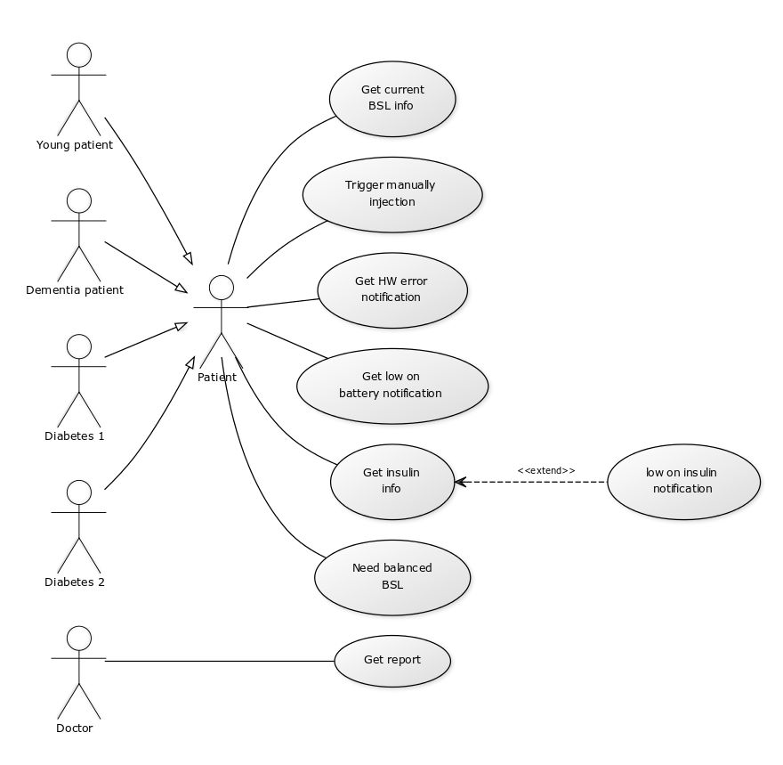

# Task 01 - Elaborate Use Cases

### 1.a User groups

+ Patient
+ Doctor

### 1.b Common use cases
+ Get current blood sugar level info
+ Trigger manual injection
+ Get hardware error notification
+ Get low on battery notification
+ Get insulin level information
    + Get low on insulin notification
+ Need balanced blood sugar level
+ Get reports

### 2 Use case diagram

### 3 Detailed use cases

+ 
+ 
+ 

